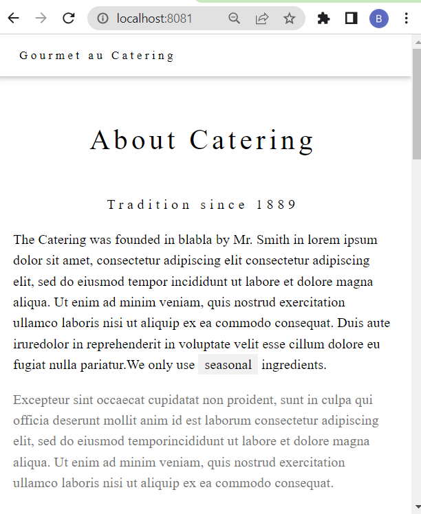

# httpd

The apache [HTTP ](https://hub.docker.com/_/httpd) Server Project

1. clone the repository
2. move to the right directory
3. Run the next commands
```bash
$ docker build -t my-apache2 .

$ docker run -dit --name my-running-app -p 8081:80 my-apache2
```
4. Open your browser on 
```python
http://localhost:8081/
```
<br/>

